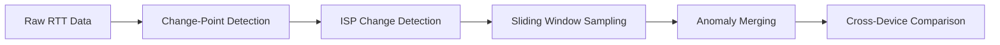

In my [previous post](link-to-post-1), I showed how we reduced network monitoring costs by 55% using shared latency anomalies. The natural follow-up question: **how do you detect shared anomalies without knowing network topology?**

This is the core technical challenge. Traditional approaches assume you have:

- **Traceroute data** showing shared network paths
- **BGP routing information** revealing AS-level connectivity  
- **Explicit topology maps** of infrastructure

In practice, you often have **none of these**:

- **Privacy constraints**: Residential users don't want traceroutes exposing their network
- **Platform limitations**: Measurement Lab, Ookla don't provide path-level data
- **Overhead**: Continuous tracerouting is expensive and intrusive

Can we infer redundancy using *only* end-to-end latency measurements?

**Yes.** Here's how.

## The Core Intuition

When two devices experience elevated latency to the same destination at the same time with similar magnitude, they're likely observing the same network event—regardless of the underlying cause.

This temporal correlation acts as a **proxy for shared infrastructure** without needing to explicitly map it.



*Figure 1: Two Comcast devices experiencing simultaneous latency spikes. The temporal overlap (IoU = 0.97) and amplitude similarity (0.89) suggest a shared cause.*

The question becomes: how do we systematically detect these correlations across thousands of measurements?

## The Pipeline: Five Key Steps

Our detection methodology consists of five stages:


Let's break down each step.

### Step 1: Change-Point Detection with PELT

**Challenge**: Identify when latency shifts from baseline to elevated state.

We use **Pruned Exact Linear Time (PELT)** algorithm instead of the original Jitterbug's Bayesian Change-Point (BCP) approach for two reasons:

1. **Speed**: PELT processes 15 days of data in ~2 seconds vs. 60-90 seconds for BCP
2. **Sensitivity**: Lower penalty parameter (0.001 ms) catches more granular changes
```python
import ruptures as rpt

def detect_changepoints(rtt_timeseries, penalty=0.001):
    """
    Detect changepoints using PELT algorithm
    
    Args:
        rtt_timeseries: Array of RTT measurements (in ms)
        penalty: Lower = more sensitive (default: 0.001)
    
    Returns:
        List of changepoint indices
    """
    # PELT with L2 cost function
    algo = rpt.Pelt(model="l2", min_size=2, jump=1).fit(rtt_timeseries)
    changepoints = algo.predict(pen=penalty)
    
    return changepoints
```

**Trade-off**: High sensitivity means many false positives (tiny fluctuations). We handle this with post-processing filters.

### Step 2: Modified Jitterbug Heuristics

Raw change-points include both **genuine anomalies** and **noise**. We apply three filtering rules:

#### Rule 1: Minimum Jump Threshold

Only mark a segment as elevated latency if mean increases by ≥ 0.5 ms:
```python
def is_latency_jump(segment_before, segment_after, threshold=0.5):
    """
    Check if transition represents meaningful latency increase
    """
    mean_before = np.mean(segment_before)
    mean_after = np.mean(segment_after)
    
    return (mean_after - mean_before) >= threshold
```

#### Rule 2: Baseline Comparison

Ensure the segment is actually elevated relative to *typical* latency:
```python
def compute_baseline(full_timeseries):
    """
    Use mode of minimum latency as baseline (robust to anomalies)
    """
    # Bin into 15-min windows, take minimum per bin
    min_rtt_per_bin = bin_timeseries(full_timeseries, window='15min').min()
    
    # Mode is most common value (typical baseline)
    baseline = stats.mode(min_rtt_per_bin, keepdims=True).mode[0]
    
    return baseline
```

#### Rule 3: Dip Detection & Memory Rule

**Problem**: Recovery from anomaly can be misclassified as a new jump.

**Solution**: Track context of previous segments:
```python
def filter_dips_and_offsets(segments, baseline):
    """
    Avoid labeling recoveries as new jumps
    """
    filtered = []
    last_was_dip = False
    last_was_jump = False
    
    for i, seg in enumerate(segments):
        mean = seg.mean()
        
        # Is this segment lower than baseline? (dip)
        if mean < baseline:
            last_was_dip = True
            last_was_jump = False
            continue
        
        # Is this a recovery from dip?
        if last_was_dip and mean < segments[i-1].mean():
            last_was_dip = False
            continue
            
        # Is this an offset from a jump (still elevated)?
        if last_was_jump and abs(seg.max() - segments[i-1].max()) < 1.5 * seg.std():
            filtered.append(seg)  # Keep as part of anomaly
            continue
            
        # New jump?
        if is_latency_jump(segments[i-1], seg):
            filtered.append(seg)
            last_was_jump = True
            
    return filtered
```

**Key insight**: The "memory rule" preserves the *duration* of anomalies by not fragmenting long events.

### Step 3: ISP Change Detection & Segmentation

**Problem**: Users sometimes switch ISPs mid-deployment. A latency jump might just be a different network.

**Solution**: Use WHOIS lookups to segment data by ISP:
```python
import ipwhois

def detect_isp_changes(measurement_data):
    """
    Identify when probe's ISP changes based on source IP
    """
    isp_segments = []
    current_isp = None
    segment_start = 0
    
    for i, measurement in enumerate(measurement_data):
        # Lookup ISP from source IP
        result = ipwhois.IPWhois(measurement.source_ip).lookup_rdap()
        isp = result['network']['name']
        
        if isp != current_isp:
            if current_isp is not None:
                isp_segments.append({
                    'isp': current_isp,
                    'start': segment_start,
                    'end': i
                })
            current_isp = isp
            segment_start = i
    
    return isp_segments
```

We apply change-point detection **independently per ISP segment** to avoid false positives.

### Step 4: Sliding Window Sampling

**Problem**: Change-points at edges of time series are unreliable (insufficient context).

**Solution**: Sample using overlapping 48-hour windows, advancing 24 hours each step:
```python
def sliding_window_detection(timeseries, window_hours=48, step_hours=24):
    """
    Detect anomalies in overlapping windows to avoid edge effects
    """
    window_size = window_hours * 12  # 5-min measurements
    step_size = step_hours * 12
    
    all_anomalies = []
    
    for start_idx in range(0, len(timeseries) - window_size, step_size):
        window = timeseries[start_idx:start_idx + window_size]
        
        # Run detection on this window
        anomalies = detect_anomalies_in_window(window)
        
        # Adjust timestamps to global timeline
        for a in anomalies:
            a.start_time += start_idx * 5 * 60  # Convert to seconds
            a.end_time += start_idx * 5 * 60
            
        all_anomalies.extend(anomalies)
    
    return all_anomalies
```

### Step 5: Deduplication & Cross-Device Comparison

**Problem**: Sliding windows create duplicate detections of the same anomaly.

**Solution**: Merge anomalies that overlap significantly:
```python
def merge_adjacent_anomalies(anomalies, iou_threshold=0.7):
    """
    Combine overlapping anomalies into single events
    """
    sorted_anomalies = sorted(anomalies, key=lambda a: a.start_time)
    merged = []
    
    current = sorted_anomalies[0]
    
    for next_anomaly in sorted_anomalies[1:]:
        iou = compute_iou(current, next_anomaly)
        
        if iou >= iou_threshold:
            # Merge: extend duration, average amplitude
            current.end_time = max(current.end_time, next_anomaly.end_time)
            current.amplitude = (current.amplitude + next_anomaly.amplitude) / 2
        else:
            merged.append(current)
            current = next_anomaly
            
    merged.append(current)
    return merged
```

Now we can compare across devices:
```python
def find_shared_anomalies(device_anomalies, iou_threshold=0.9):
    """
    Identify anomalies shared across multiple devices
    """
    shared_events = []
    
    for dest in destinations:
        # Get all anomalies to this destination
        dest_anomalies = [a for device in device_anomalies 
                         for a in device if a.destination == dest]
        
        # Group by temporal overlap
        groups = cluster_by_iou(dest_anomalies, threshold=iou_threshold)
        
        for group in groups:
            if len(group) >= 2:  # Shared by at least 2 devices
                shared_events.append({
                    'destination': dest,
                    'devices': [a.device_id for a in group],
                    'iou': min_pairwise_iou(group),
                    'amplitude_similarity': amplitude_similarity(group),
                    'impact': sum(a.amplitude * a.duration for a in group)
                })
    
    return shared_events
```

## Key Metrics: IoU and Amplitude Similarity

### Intersection over Union (IoU)

Measures temporal overlap:

$$
\text{IoU}(E_1, E_2) = \frac{\min(e_1, e_2) - \max(s_1, s_2)}{\max(e_1, e_2) - \min(s_1, s_2)}
$$

Where $s_i, e_i$ are start and end times.

- **IoU = 1.0**: Perfect overlap
- **IoU = 0.5**: Half the duration overlaps
- **IoU = 0.0**: No overlap

### Amplitude Similarity

Ratio of smaller to larger amplitude:

$$
\text{Similarity} = \frac{\min(A_1, A_2)}{\max(A_1, A_2)}
$$

Where $A_i$ is anomaly amplitude (max RTT - baseline).

## Empirical Findings: What Actually Correlates?

After running this pipeline on 99 devices over 4 months, here's what we found:

### Finding 1: High IoU Predicts Similar Amplitude



*Figure 2: Amplitude similarity vs. temporal overlap. Median similarity reaches 0.88 for IoU ≥ 80%.*

**Implication**: Temporal overlap alone is sufficient to identify redundant measurements.

### Finding 2: Same-ISP Events Show Stronger Correlation

| Condition | Median Amplitude Similarity (IoU ≥ 80%) |
|-----------|----------------------------------------|
| Same ISP | **0.89** |
| Different ISP | 0.85 |

**Implication**: ISP-level infrastructure sharing is detectable without topology.

### Finding 3: Shared Anomalies Aren't Random

We validated this with a randomization test:

1. Shuffle anomaly timestamps (preserve duration/amplitude)
2. Recalculate IoU distributions
3. Repeat 1,000 times

**Result**: 
- **Real data**: 23% of anomalies have IoU ≥ 0.8
- **Shuffled data**: 1.46% ± 0.009%

The correlation is **real**, not an artifact of measurement noise.

## Handling Edge Cases

### Edge Case 1: Bufferbloat

**Symptom**: Extremely large amplitude (>1000 ms) anomalies that don't correlate across devices.



**Detection**: Flag probes with <5% of anomalies showing IoU ≥ 0.8.

**Mitigation**: Exclude from probe selection (likely local issue, not network-wide).

### Edge Case 2: Oscillating Baseline

**Symptom**: Baseline latency fluctuates ±1-2 ms, causing many small "jumps".

**Detection**: High variance in inter-anomaly baseline segments.

**Mitigation**: 
- Use robust baseline (mode instead of mean)
- Increase jump threshold to 1.0 ms for high-variance probes

### Edge Case 3: Long-Duration Pseudo-Anomalies

**Symptom**: Merging many tiny jumps creates artificial 168-hour "anomaly".

**Detection**: Anomaly duration > 7 days + low max IoU (<0.6) with other devices.

**Mitigation**: Cap max anomaly duration or require minimum amplitude/duration ratio.

## Production Implementation Considerations

### Scalability

Our implementation processes 14.6M measurements in ~45 minutes on a single machine:
```python
# Parallelization strategy
from multiprocessing import Pool

def process_probe(probe_data):
    """Process single probe's data independently"""
    return detect_anomalies(probe_data)

if __name__ == '__main__':
    with Pool(processes=8) as pool:
        results = pool.map(process_probe, all_probe_data)
```

### Data Pipeline Integration

For production deployment, integrate with workflow orchestration:
```python
# Example Airflow DAG
from airflow import DAG
from airflow.operators.python import PythonOperator

with DAG('anomaly_detection', schedule_interval='@daily') as dag:
    
    fetch_data = PythonOperator(
        task_id='fetch_measurements',
        python_callable=fetch_from_measurement_db
    )
    
    detect = PythonOperator(
        task_id='detect_anomalies',
        python_callable=run_detection_pipeline
    )
    
    deduplicate = PythonOperator(
        task_id='merge_anomalies',
        python_callable=deduplicate_across_probes
    )
    
    store = PythonOperator(
        task_id='store_results',
        python_callable=write_to_anomaly_db
    )
    
    fetch_data >> detect >> deduplicate >> store
```

### Monitoring & Validation

Track these metrics to ensure pipeline health:
```python
class DetectionMetrics:
    def __init__(self):
        self.total_measurements = 0
        self.total_anomalies = 0
        self.shared_anomalies = 0
        self.probes_with_no_anomalies = []
        self.median_iou = 0
        
    def validate(self):
        """Sanity checks"""
        assert self.total_anomalies > 0, "No anomalies detected!"
        assert self.shared_anomalies / self.total_anomalies > 0.05, \
            "Suspiciously low sharing rate"
        assert len(self.probes_with_no_anomalies) < 0.1 * num_probes, \
            "Too many silent probes"
```

## Try It Yourself

Complete implementation available on GitHub:

🔗 **[network-optimizer/detector](https://github.com/yourusername/network-optimizer/tree/main/detector)**

### Quickstart
```bash
# Install
pip install network-optimizer

# Run on your data
from network_optimizer import AnomalyDetector

detector = AnomalyDetector(
    iou_threshold=0.9,
    min_amplitude=0.5,
    window_hours=48
)

anomalies = detector.detect(your_rtt_data)
shared = detector.find_shared_anomalies(anomalies)
```

### Interactive Notebook

Full walkthrough with visualizations:

🔗 **[Detection Methodology Notebook](https://github.com/yourusername/network-optimizer/blob/main/notebooks/02_detection_methodology.ipynb)**

## What's Next?

In the next post, I'll explore the **geographic dimension**: why probe diversity matters even within a single city, and how to optimally place probes when you're planning a new deployment.

**Preview**: One Chicago zip code contributed 11 of 44 selected probes and captured 1,653 unique anomalies. Why? And what does this tell us about the digital divide?

---

**Questions?** Drop a comment below or open an issue on GitHub.

**Want to apply this to your infrastructure?** I'm available for consulting on measurement optimization and performance analysis.

📧 **[Get in touch](mailto:your.email@domain.com)**

---

## References

- Killick, R., Fearnhead, P., & Eckley, I. A. (2012). Optimal detection of changepoints with a linear computational cost. *JASA*.
- Carisimo, E., Mok, R. K., Clark, D. D., & Claffy, K. (2022). Jitterbug: A new framework for jitter-based congestion inference. *PAM 2022*.
- [PELT Python implementation](https://centre-borelli.github.io/ruptures-docs/)